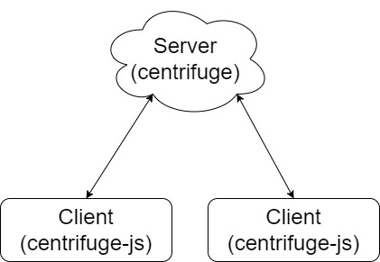
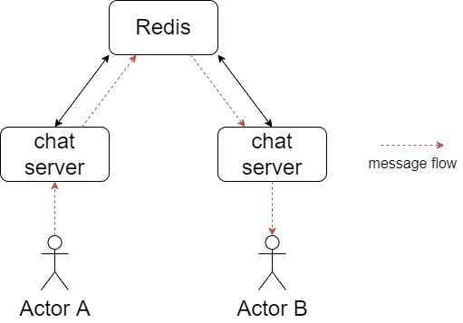
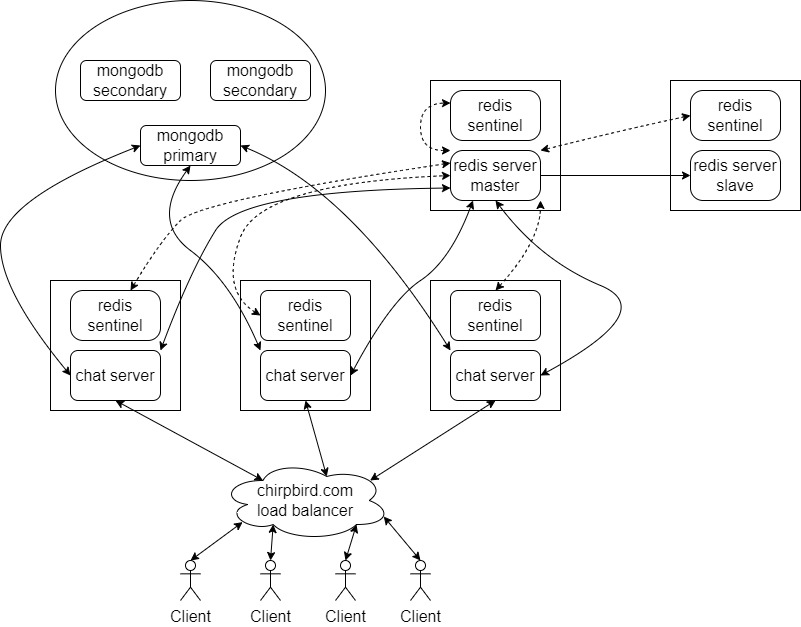
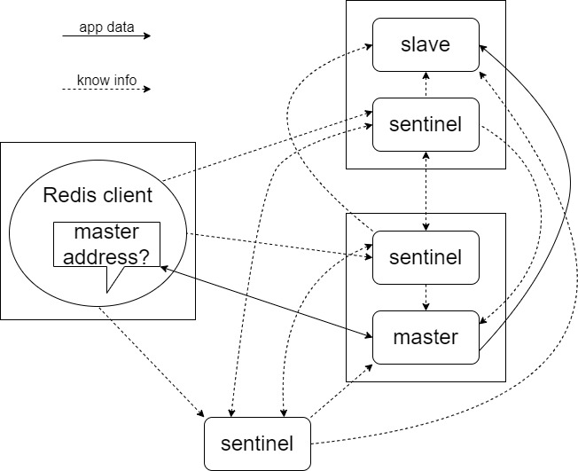
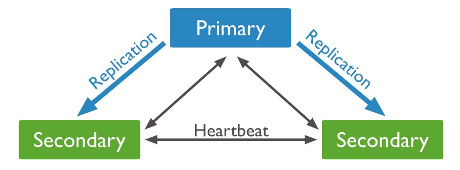
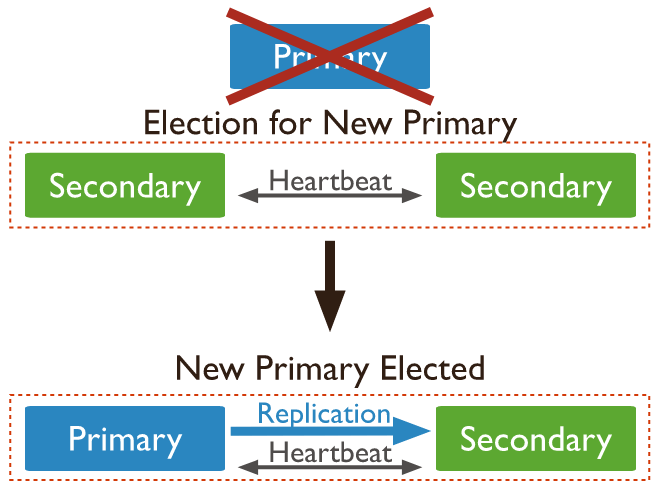

# System Design 
We will tackle this based on the feature that are listed on the challenge

## 1. Capable of delivering chat text message instantly through websocket, and support P2P & group chat
---


To be able to deliver this feature, we need some kind of event based real time library, where one client emit an event, and the other listen to it. In NodeJS, it is kind of [Socket.IO](https://socket.io/).

But I could not find a good socket.io server implementation in Go. The most popular one is not supporting the latest v3 client. Writing new solution on this will be very cumbersome, because there are lots of things that need to be done, plus need to write new client that compatible with it.

With extensive browsing, I found [Centrifugo](https://centrifugal.github.io/centrifugo/), but it is a standalone service. Luckily, the maintainer separate its engine as Go library [Centrifuge](https://github.com/centrifugal/centrifuge). Also, it has the client implementation for web app as [centrifuge-js](https://github.com/centrifugal/centrifuge-js).



The rest is just simply how to model the data and app flow between the server and client. How to make private group (between two user) or public group.

This is not a real peer to peer app, because clients cannot talk directly to each other. I don't think it is possible now with Websocket. The go to for this kind of communication maybe possible by using [WebRTC](https://webrtc.org/).

## 2. Horizontally Scalable
---

Horizontal scaling means adding more node for better performance, so the connection and request will not be served by single service only. And when two node is not enough, run three, and so on.

Centrifuge on default is using memory broker, which performant, but cannot scale well because the limitation of memory not shared by every node. Thankfully, it provides us alternative with Redis as its broker. Now every node can share memory to each other, and correctly publish event to every connected clients.



In a way, adding more chat server node will allow us to serve more connection. When the time the persistence and memory sharing itself become bottlenecks, sharding and clustering may work. But I think this kind of optimization should be done later.

## 3. Resilient from failure
---

Adding more nodes doesn't make the app failsafe. It still need additional things for high availability (HA). Let's start from the architectural diagram



We will go through the diagram one by one

### Client and Load Balancer
---
Client should only know the domain name. It should not know rest of the stuff

Each request from client will be received by the load balancer. The request will be distributed to each available server (round robin by default with HAProxy). For the sake of simplicity, I use HAProxy in this layer. It has healthcheck feature that will sending ping request to each nodes, and detect which nodes are failing, so it will be removed from serving more connection.

This load balancer can be a failure point itself. No fun when the thing that should make it more resilient fail itself. Make load balancer to be HA including rewriting DNS resolver record for the new appointed load balancer. It far too abroad topic and may be fixed by using physical device or using cloud providers that has some kind of high HA load balancer.

### Redis
---
In Centrifuge, Redis served as the connecting point for each node, that will save the state of which node that should push to which client, and also sharing all the connection details.

To avoid catastrophical failure which will happen if our Redis gone down, we run another replica (slave). The replica will syncing the master data asynchronously, so data loss can still happen in a very short period, but in my take, Chirpbird messenger allowing this :D. Redis replica is running in read only mode. When the master went down, the replica will promote itself in master mode, and now can have read-write access.

But, the app will not know when those things happened, it won't know the master went down, or now the current master is the old replica. Redis sentinel is another way to figure that. Sentinels are connected to the master, and fetching all the replica addresses that are syncing from the master node. Then, they act like a voting group if the master is not accesible, and decide which new node that redis client should use.

In Centrifuge, with its Redis adapter, we will not connect to the redis master at the app startup. The initialization will list all of the sentinels addresses, and the redis adapter will fetch the current master node address, and automatically change the redis driver to use that node. So in case the master went down, redis driver will be updated by Centrifuge redis adapter with new address and the app carries on. Smart, huh.

```
// For the sake of simplicity, I'll ignore error handling

// the function name is NewRedisShard,
// but it uses the same struct to initiate replica
replica, _ := centrifuge.NewRedisShard(centrifugeNode, centrifuge.RedisShardConfig{
    SentinelAddresses:  strings.Split(os.Getenv(env.REDIS_SENTINEL_ADDRESSESES), ","),
    SentinelMasterName: os.Getenv(env.REDIS_MASTER_NAME),
})

redisBroker, _ := centrifuge.NewRedisBroker(centrifugeNode, centrifuge.RedisBrokerConfig{
    Shards: []*centrifuge.RedisShard{replica},
})

redisPresenceManager, _ := centrifuge.NewRedisPresenceManager(centrifugeNode, centrifuge.RedisPresenceManagerConfig{
    Shards: []*centrifuge.RedisShard{replica},
})

node.SetBroker(redisBroker)
node.SetPresenceManager(redisPresenceManager)
```

Redis sentinel can run on the client node, on the redis server node, or a single node sentinel itself. It doesn't matter, as long the minimum living sentinel is two. I've provided new diagram, hopefully making it simpler.



In the chart above, if the redis master node go down, we still have sentinel in the slave node, and the single node to let the app know to change master address. Adding more slave node can be done too if we need more replication.

For how to run redis setup with replication and sentinel, [this guide](https://severalnines.com/database-blog/redis-high-availability-architecture-sentinel) will help. 

### Mongodb
---
Why I choose Mongodb? No particular reason. In my thought, for this kind of app, I can leverage more the schemaless nature of Mongodb. In example, rather than storing chats into one table and query them based on which group it has been sent, we can simply put one group chat history into its own `Collection` (kinda like table in RDBMS), and will always pull from that without querying within many more other group chats (arguably, indexing in RDBMS is also pretty fast for that).

The most reasonable reason I guess, it's just easy to use Mongodb for proof of concept app, playing around with it without establishing a fool proof schema relationship upfront.

Mongodb can also run with replica, with a lot less complexity than Redis. By default, Mongodb provides heartbeat checking to each member of the replica set, so they can detect outage by themself and promote new secondary node as primary.




[Mongo Go driver](https://github.com/mongodb/mongo-go-driver) supports run on replica set topology by just providing the connection URI with multiple host
```
options.Client().ApplyURI("mongodb://localhost:27017,mongodb://localhost:27018")
```

At the architectural diagram, the replica set drawed as one set for simplicity.

For how to run Mongodb replica set, [this guide](https://docs.mongodb.com/manual/tutorial/deploy-replica-set/) will help.

## More on the project
- [API Documentation for client integration](API.md)
- [Entity Schema](schema.md)
- [Failsafe Mechanism](failsafe.md)