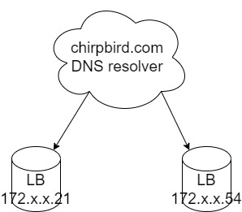
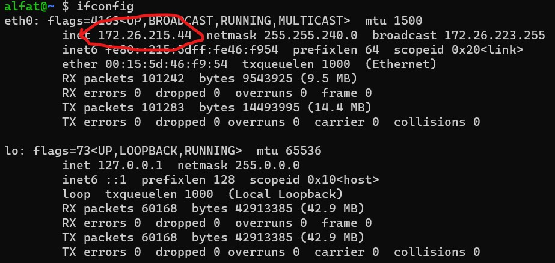

## Failsafe Mechanism

We take a look again with this diagram


Our failure points can happen within
- Load Balancer layer
- Chat Server nodes
- Redis nodes
- Mongodb nodes

But each of it should automatically resilient from failure and keep running, if majority of the backup/slave/secondary node still up and running.

### Failure on Load Balancer
---
This could be catastrophical if it really happens. From my experience, the software load balancer itself (nginx, HAProxy, etc) rarely gives problem if configured well enough. In most cases, it related to human error, like forgetting to update the SSL certificate. Another reason is bad provider. In my experience from my previous workplace, one data center that host our server rack keep lose its internet connections and all request need to be routed to other location by configuring the DNS resolver to point domain to backup data center, this needs human intervention. In some way, we can put more than one IP to our DNS A record



But I don't know how well this is, because most DNS server is only serve with Round Robin, which will still forwards to the failing load balancer (LB). Most domain name also being cached by browser. Other solution is using a cloud provider to host our application, which has some kind of high available (HA) load balancer layer. Linode, Digital Ocean, GCP, and AWS has their own solution of this.

### Failure on App Server
---
By using HAProxy, we automate the process of routing connection to healthy backend. The goal is to distribute our failure point, so it'll be more reliable if we host each node in different location. HAProxy will send a request to do healthcheck for every backends, and if backends aren't responding with positive HTTP status code (such as 200), it'll automatically removed from HAProxy's working backend list. Within this time, we can figure out what is wrong with the one that is failing out. Maybe full storage, out of memory, or full CPU usage, something that can happen to the other nodes.

Or maybe, the data center which host that node, is failing. But everything is well if that is the case, because as soon as the node available, it will serve normally if detected healthy by HAProxy.

### Failure on Persistence
---
Our backend app connected to Mongodb instances that work as a replica set. This easily done by providing the replica set config to one of the mongo instance, and they together will work as a replica set. Example of the config
```
rsconf = {
    _id : "rsmongo",
    members: [
        {
            "_id": 0,
            "host": "mymongohost1.com:27017",
            "priority": 3
        },
        {
            "_id": 1,
            "host": "mymongohost2.com:27017",
            "priority": 2
        },
        {
            "_id": 2,
            "host": "mymongohost3.com:27017",
            "priority": 1
        }
    ]
 }

 rs.initiate(rsconf)
```
You can supply this config to any Mongodb db nodes, `mymongohost1.com`, `mymongohost2.com`, or `mymongohost3.com`. As long as they can discover each other. Distribute Mongodb nodes in different data center is a common thing, but need to be carefully tuned, because replication happen in asynchronous way, so when primary node becomes unavailable, some secondaries' data can be left behind. This need some configuration to tune which priority each node has. In the config file above, `mymongohost1.com` has biggest priority, then `mymongohost2.com` because it's the nearest to `mymongohost1.com`, and so on. In some cases, when data go out of sync, we need to fetch some not synced data from the old primary, push it to current primary, and let the old primary join the replica set. Or, if your app is not very critical to this circumstances, let it be :D

### Failure on Redis
---
Redis act as one big pool of memory, sharing between our chat backend app. Losing access to it, and all the websocket connection identifier and communication between backend app will be gone. Same with Mongodb, Redis has its own way to run in replica mode, this already thoroughly explained within the [architectural part](README.md).


Simply identify your master name with Redis Sentinel, and any redis driver that can leverage this sentinel functionality will automatically change the application to use current master.

### Demonstrate the Outage
---
I provide a [Docker compose file](../docker-compose.yml) that can in a way, modeling the architecture, and proving it is failsafe. You can open the compose file in another tab, and we go through it together.

We have `redis1` and `redis2` services, that run as a redis server. But with `redis2`, we put the command

```
redis-server --slaveof ${HOST_DOCKER_INTERNAL_IP} 6380
```
to make it run as slave of `redis1`. Because of how the way Redis sentinel working and mapping each slave using IP address and port, it is not possible to use hostname in docker for sentinel ([look into this](https://redis.io/topics/sentinel#sentinel-docker-nat-and-possible-issues)), so we need to port forward each redis to different port, and access it using our host IP from the container. Using `ifconfig` for linux, can figure out that IP address.



Next we have three redis sentinel services, configured as this
```
redis-sentinel1:
    image: bitnami/redis-sentinel:6.2
    environment:
      - REDIS_MASTER_HOST=${HOST_DOCKER_INTERNAL_IP}
      - REDIS_MASTER_PORT_NUMBER=6380
      - REDIS_SENTINEL_DOWN_AFTER_MILLISECONDS=10000
      - REDIS_SENTINEL_FAILOVER_TIMEOUT=5000
      - REDIS_SENTINEL_QUORUM=2
      - REDIS_SENTINEL_PORT_NUMBER=26379
      - REDIS_SENTINEL_ANNOUNCE_IP=${HOST_DOCKER_INTERNAL_IP}
    depends_on:
      - redis1
      - redis2
      - redis3
    ports:
      - '26379:26379'
```
This makes sentinel services monitor current master (`redis1`), and from the master itself, the sentinels can figure out which other redis currently run as replica of that master. 

Before playing around with the docker compose, please change the value on `.env` file within the root of this repository with your host docker internal IP. Next, you can try to run `docker-compose up` and kill the `redis1` container, take a look at the logging and you will see the process of new master selection. Client (browser) may disconnect and reconnected again.

Other service is `mongodb1`, `mongodb2`, and `mongodb3`. Each run as replica set with command
```
mongod --replSet rsmongo --bind_ip_all
```
and one additional service that function as a mongoclient that will feed the `mongodb1` with the config in this [section](#failure-on-persistence). Why need additional service for this? Can't it be done directly within the container? I've tried, and fail miserably, lol. The Mongodb instances must be ready and available when the config provided, so when putting it before the container itself start, it still in an unreachable state.

Same with Redis, you can try to turned down some mongodb container, and make sure the app still works as expected.

And to demonstrate the backend app itself, just kill some containers of `backend` and clients that are connected to that node will reconnected again to new node that still serving connection